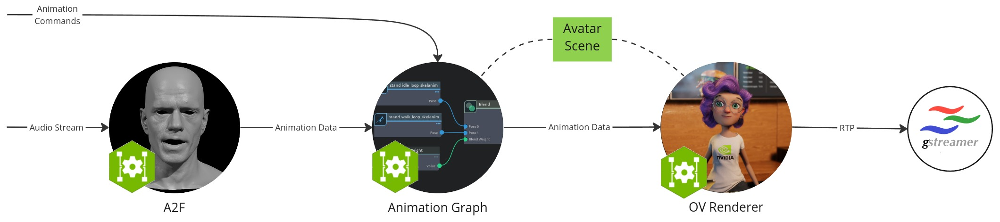

# Audio2Face Omniverse DIY Guide

This repository provides complete practical guides and sample code for using NVIDIA Omniverse Audio2Face.


*System Flow Diagram from NVIDIA Tutorial Guide*
> This guide is based on NVIDIA official documentation [Docker with Omniverse Renderer](https://docs.nvidia.com/ace/latest/workflows/animation_pipeline/docker_with_omniverse_renderer.html) and extended by practical experience.

## Prerequisites

> ⚠️ **Important Note**: Please refer to [NVIDIA 官方文档](https://docs.nvidia.com/ace/latest/workflows/animation_pipeline/docker_with_omniverse_renderer.html) for system requirements and environment configuration.

- 🔑 NVIDIA AI Enterprise (NVAIE) License
  - Register [NVIDIA AI Enterprise](https://www.nvidia.com/en-us/ai-enterprise/) account
  - Get 90-day free trial license
  - Need to purchase official license after trial period ends

- 🔑 NVIDIA GPU
  - NVIDIA GPU with CUDA support
  - ⚠️ NVIDIA Container Toolkit ⚠️

- 🔑 NGC API Key 登入
  - Login to [NGC](https://ngc.nvidia.com/) to get API Key
  - Use API Key to login Docker Registry:
    ```bash
    echo <YOUR API Key> | docker login nvcr.io -u $oauthtoken --password-stdin
    ```
    
- NGC CLI tools installation
  - Follow instructions from [NGC CLI Download Page](https://org.ngc.nvidia.com/setup/installers/cli) to download and install NGC CLI tools
    ```
    unzip ngc-cli_linux.zip
    chmod u+x ngc-cli/ngc
    mv ./ngc-cli /opt/ngc-cli
    ln -s /opt/ngc-cli/ngc /usr/local/bin/ngc
    ```
  - Login NGC
    follow the instructions, set the API Key
    ```bash
    ngc config set
    ```

## Features

- 🎯 Complete Audio2Face deployment workflow
- 🚀 Docker containerization configuration
- 💡 Detailed tutorials and examples
- 🛠 Reusable scripts and tools

## Quick Start

1. Clone Repository
```bash
git clone https://github.com/yourusername/audio2face-omniverse-diy-guide.git
cd audio2face-omniverse-diy-guide
```

2. Environment Configuration
```bash
./scripts/setup/install.sh
```


3. Download Default Avatar Model
```bash
ngc registry resource download-version "nvidia/ace/default-avatar-scene:1.0.0"
```
* ⚠️ 需要先登入 NGC 才能下載模型
* ⚠️ Notice that should update the docker compose file for loading the model

4. Run Example
```bash
docker compose up
```

## Documentation

- [Getting Started Guide](docs/getting-started.md)
- [Installation Guide](docs/installation.md)
- [Configuration Guide](docs/configuration.md)
- [Troubleshooting Guide](docs/troubleshooting.md)

## Directory Structure

```
docs/          - Detailed documentation
examples/      - Example code
scripts/       - Script files
src/           - Source code
tests/         - Test cases
docker/        - Docker configuration
```

## Contribution

Welcome to submit Issue and Pull Request!

## License

This project is licensed under the MIT License - see the [LICENSE](LICENSE) file for details.
